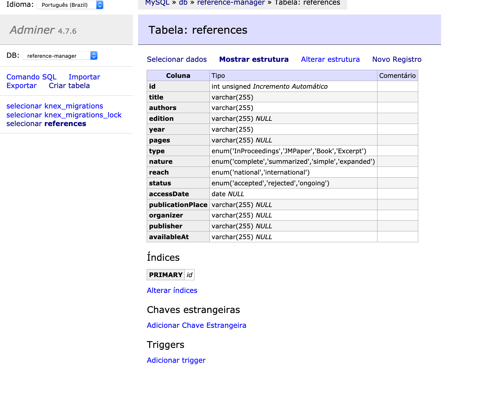
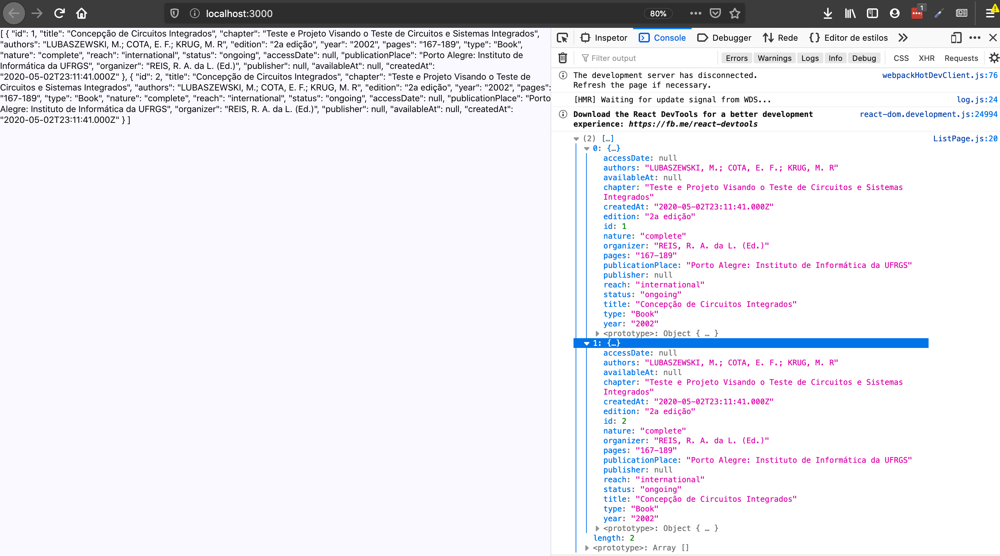

# Tutorial do projeto de Aplicação de Gestão de Conteúdo

Autor: Leonardo Marcelino Vieira
Repositório GIT: https://github.com/Zugruul/gerenciador-referencias-bibliogr-ficas

## Enunciado

Você pode ver o enunciado deste trabalho [aqui](enunciado.md).

## Sobre as Tecnologias

Foram escolhidas as seguintes tecnologias para desenvolver trabalho:

+ Node.js para o Backend da aplicação;
+ React.js para o Frontend da aplicação;
+ Docker para conteinerização e deploy da aplicação;

## Rodando o projeto rapidamente

1. Execute `$ docker-compose up` na pasta do backend para subir uma instancia do MySQL
2. Execute `$ npm install` nas pastas do backend e do frontend para instalar dependencias
3. Execute `$ npm start` na pasta do backend.
4. Execute `$ npm start` na pasta do frontend.

Notas importantes: 
+ Nenhum dos ambientes está realmente configurado para produção. Por não ter se destinado a isso e por falta de tempo para realmente fazê-lo.
+ Está hardcodado na frontend as URLs do backend. Se portas vierem a mudar, deverá ser alterado em nos dois componentes que fazem chamadas de API.

### NodeJS

O [Node.js](https://nodejs.org/en/) é um interpretador de JavaScript construido em cima da engine V8 do Google Chrome. Foi criado em 2009 por Ryan Dahl. Ganhou grande sucesso e repercussão visto que permite que uma única linguagem (o Javascript) seja usado para desenvolvimento tanto de aplicações Web quanto de Serviços (Backend) que estas necessitam.

### React.js

O [React.js](https://pt-br.reactjs.org/), ou React de forma curta, é uma biblioteca javascript que deixa de lado as templates html para adotar o JSX (que tem um formato parecido, mas que a template fica em arquivos javascript junto com a implementação daquela parte da aplicação), tem como principios ser declarativo, reativo e utilizar de composição (acima de herença, de linguagens orientadas a objeto) para construir páginas webs e componentes para as mesmas. Por ser baseada em componentes, garante o encapsulamento dos mesmos, tornando reuso e composição de UIs utilizando diferentes componentes mais fácil. 

### Docker

O [Docker](https://www.docker.com/) fornece uma camada de abstração em cima de virtualizaçao de sistemas operacionais, permitindo isolamento de aplicações e autogerenciamento de recurso para execução e deploy ágil das mesmas. É construido em GOLang, linguagem da Google.

## Configuração do Ambiente

### Subindo nossa instância de MySQL usando Docker

Utilizaremos o docker para subir uma instância do banco de dados [MySQL](https://www.mysql.com/) utilizando uma imagem disponível [aqui](https://hub.docker.com/_/mysql) Para tal criaremos na pasta do nosso backend um arquivo chamado de **docker-compose.yml**

```yml
version: '3.1'

services:

  db:
    image: mysql
    command: --default-authentication-plugin=mysql_native_password
    restart: always
    environment:
      MYSQL_ROOT_PASSWORD: example
      MYSQL_DATABASE: reference-manager
    ports:
      - 3306:3306
  adminer:
    image: adminer
    restart: always
    ports:
      - 8080:8080
```

Tendo Docker e Docker compose instalados, após seguir as instruções de instalação, podemos então subir este container que irá expor uma instância do adminer na porta 8080 e um servidor do MySQL na 3306. Execute o seguinte comando, no terminal na mesma pasta do arquivo docker-compose, para o mesmo:

```bash
$ docker-compose up
```

Na primeira vez que for utilizar uma determinada imagem, a mesma será baixada, como exemplo abaixo.

Podemos parar a execução desse container com o seguinte comando:

```bash
$ docker-compose down
```

e para ver uma lista de containers sendo executados podemos executar o seguinte comando:

```bash
$ docker ps
```

Recomendo uma leitura sobre os demais comandos do [docker clicando aqui](https://docs.docker.com/engine/reference/commandline/docker/) e do [docker-compose clicando aqui](https://docs.docker.com/compose/reference/overview/).

Continuando de onde paramos, após terminado o download da imagem a mesma é utilizada como base para subir nossa aplicação. Se formos na aplicação rodando em `localhost:8080` na nossa máquina, veremos a interface do Adminer:


Podemos logar com as seguintes credênciais conforme configurado no nosso docker-compose:

```
usuário: root
senha: example
base de dados: reference-manager
```

Lá temos um gerenciamos de banco de dados via interface gráfica, caso queiramos investigar ou averiguar algo.

#### Como instalar

Recomendo sempre ler as instruções na documentação oficial, além de seguir tutoriais como este, a caráter de brevidade e de estar o mais atualizado possível não irei entrar em detalhes de como instalar, mas sim redirecionar para o lugar apropriado.

O Docker pode ser obtido para instalação gratuitamente [nesta página](https://www.docker.com/get-started) ou [aqui](https://docs.docker.com/engine/install/) se preferir instruções mais detalhadas. Após instalado também é necessário obtermos, para fins deste tutorial, o docker compose que você pode ver mais sobre [aqui](https://docs.docker.com/compose/install/)

### Instalando o Node.js

As últimas versões podem ser obtidas [aqui](https://nodejs.org/en/). Recomenda-se o uso da versão LTS vigente (Long-term support), visto que normalmente é a mais estável. Do momento que escrevo este artigo, estamos na versão 12.16.3 do Node.js, que será chamado de Node daqui para frente.

Feita a instalação, estará disponível no Path do seu sistema operacional para uso via terminal.

É possível rodar o comando `$ node` e obter um terminal interativo para execução de código Javascript. Se digitarmos:

```javascript
console.log('Hello world')
```

Teremos o clássico exemplo do hello world, mas em javascript!


É possivel executar um arquivo .js passando o path até o mesmo como parâmetro:

```bash
$ node app.js 
```

#### Criando o projeto do Backend

Para iniciarmos um projeto novo devemos executar o seguinte comando:

```bash
$ npm init
```

Isto irá criar o arquivo package.json, após uma série de perguntas, para podermos compartilhar o mesmo com outros desenvolvedores e estes de forma ágil conseguirem instalar as dependencias do projeto e executar scripts de inicialização e desenvolvimento que configurarmos.

Após executado teremos algo assim:

```json
{
  "name": "backend",
  "version": "1.0.0",
  "description": "",
  "main": "index.js",
  "scripts": {
    "test": "echo \"Error: no test specified\" && exit 1"
  },
  "author": "Leonardo Marcelino Vieira",
  "license": "MIT"
}
```

Crie uma apsta chamada src, ou como preferir, dentro dela um arquivo chamado `server.js`. Vamos atualizar nosso package.json:

```json
{
  "name": "backend",
  "version": "1.0.0",
  "description": "",
  "main": "index.js",
  "scripts": {
    "start": "node src/server.js",
    "test": "echo \"Error: no test specified\" && exit 1"
  },
  "author": "Leonardo Marcelino Vieira",
  "license": "MIT"
}
```

ali nos scripts adicionamos um comando para executar a aplicação e se colocar o nosso Hello world de antes e executarmos usando o comando abaixo você verá o output no terminal *Hello world* no terminal.

```bash
$ npm run start
```

#### Fazendo nossa primeira API

Vamos agora fazer uma API rodando uma simples rota na raiz da URL `http://localhost:3007` que nos retorna em texto Hello World.

Primeiramente vamos utilizar o framework [Express](https://expressjs.com/pt-br/) para Node.js, este irá lidar com toda a parte de HTTP e Rotas da nossa aplicação. Para instalar digite o seguinte:

```bash
$ npm install express body-parser cors
```

Vamos precisar também do middleware [body-parser](https://github.com/expressjs/body-parser), para mais tarde no processo de criação do nosso CRUD básico.

Se quiser saber mais sobre dependências em Node, recomendo a seguinte leitura [aqui](https://docs.npmjs.com/cli/install).

Feita a instalação temos agora na raiz do nosso projeto uma pasta node_modules, com todas as dependencias e dependencias de dependencias que instalamos. Da seguinte forma: 


Podemos agora, dentro do nosso `server.js` utilizar o seguinte código:

```javascript
const express = require('express');
const bodyParser = require('body-parser');
const cors = require('cors')
const app = express();
const PORT = 3007;

app.use(bodyParser.urlencoded({
  extended: true
}));
app.use(bodyParser.json());
app.use(cors())

app.get('/', function (req, res) {
  res.send('Hello World!');
});

app.listen(PORT, function () {
  console.log(`App está rodando na porta ${PORT}!`);
});
```

e rodando a aplicação utilizando `$ npm run start` e irmos até o navegador na página em `localhost:3007`, devemos ver o seguinte:


#### Passos Iniciais

Além do express, devemos pensar que vamos ter um banco de dados e vamos precisar realizar queries no mesmo. Para tal existem algumas bibliotecas que facilitam nosso trabalho nos dando uma interface limpa e **segura** para realizar queries. Por que digo segura? Porque essas bibliotecas nos protegem de coisas como [SQL injections](https://pt.wikipedia.org/wiki/Inje%C3%A7%C3%A3o_de_SQL) e outras vulnerabilidades de segurança, caso contrário teriamos que tomar muito **mais** cuidado com nossas implementações se trabalhassemos direto com o driver do banco de dados. Não é escopo deste tutorial isto, mas se quiser ler mais sobre recomendo fontes como as diversas páginas de segurança da web e de hacking do [Reddit](https://www.reddit.com/r/websecurity/) lá diversos usuários discutem e compartilham noticias e tutoriais diariamente sobre diversas áreas.

Para fins deste tutorial utilizaremos a biblioteca [Knex.js](http://knexjs.org/) para ser nossa query-builder e MySQL2 como nossa biblioteca para comunicaçãoc om o driver MySQL. Para tal executaremos a sua instalação (note que podemos passar mais de uma biblioteca para instalarmos ao mesmo tempo):

```bash
$ npm install knex mysql2
```

Dai podemos configurar nosso knex. A biblioteca fornece um comando para inicializarmos um projeto usando a mesma. Para isso devemos instalar ela globalmente (`$ npm install knex -g`) e então executar `$ knex init`. Outra opção é executa-la usando o comando `$ npx knex init`, que instala ela temporariamente e executa esse comando, ou utiliza a versão instalada localmente no projeto, se estiver disponivel.

Não entrarei em detalhes de proteger suas várias de ambiente utilizando javascript. Caso queira saber mais, veja [isso aqui](https://github.com/motdotla/dotenv)

Além disso não utilizaremos, para fins deste tutorial, ambientes de desenvolvimento diferentes, mas já deixarei meio pré-configurado caso queiramos entrar no assunto futuramente, utilizaremos o knexfile criado na raiz do projeto conforme a seguir:

```javascript

```

Além disso criaremos na pasta `src` o arquivo knex.js que é uma instância configurada do knex utilizando estes parâmetros no knexfile:

```javascript
const environment = process.env.ENVIRONMENT || 'development'
const config = require('../knexfile.js')[environment];
module.exports = require('knex')(config);
```

#### Etapa de planejamento do Backend

Para cada individuo e organização este processo se dará de forma diferente. Seja uma especificação UML obtida no processo inicial de Engenharia de Requisitos ou outro processo, é importante identificar de forma inteligível so requisitos de cada sistema e subsistema, necessidades de interface gráfica, dados que seram mostrados, etc.

A minha abordagem predileta é expor de forma alto nivel os dados necessários das diversas partes da aplicação, da seguinte forma. Exemplo abaixo:


Nós temos informação estática no topo, assim como cabeçalhos também estáticos, tempos um botão para adicionar referencias e dois referentes a sorting.

Dos dados então temos os seguintes campos que devemos obter de um servidor externo:

```md
  - id
  - title
  - authors
  - edition
  - year
  - pages
  - type: ['InProceedings', 'JMPaper', 'Book', 'Excerpt]
  - nature: ['complete', 'summarized', 'simple', 'expanded]
  - reach: ['national', 'international]
  - status: ['accepted', 'rejected', 'ongoing]
  - accessDate
  - publicationPlace
  - organizer
  - publisher
  - availableAt
```

Essa é uma analise bem crua, mas é bom inicio para resolução do problema.

#### CRUD Básico de Lista de Referencias

Para organizar tudo, será criada uma pasta services, com serviços de manipulação basicos dos nossos dados para todas as operações (Create, Read, Update, Delete), detalhadamente em Read irei separar em duas categorias: Read and List, que respectivamente obtém um item apenas ou a lista com todos os itens de acordo com parâmetros especificados.

para tal cria-se uma pasta `services`, dentro da `backend` com um arquivo indice e um arquivo com o nome do serviço em si:

```
- backend
  - services
    - index.js
    - references.js
```

Dentro deste `references.js` mapeamos o esqueleto do nosso serviço da seguinte forma:

```javascript
const knex = require('../knex')

module.exports.create = function(reference) {

}


module.exports.list = function(params) {
  
}

module.exports.read = function(id) {
  
}

module.exports.update = function(id, reference) {
  
}

module.exports.delete = function(id) {

}
```

Para cada qual será feita a implementação de acordo com a documentação do Knex.js. Por exemplo abaixo temos a implementação de `list`:

```javascript
module.exports.list = function(params) {
	const { orderBy, isDesc } = params || {}
	const order = isDesc ? 'desc' : 'asc'

	return instance()
		.select()
		.orderBy(orderBy || 'id', order)
}
```

**O que está acontecendo?** Primeiramente selecionamos usando *select* os campos que queremos, neste exemplo rapido vou pegar todos, um shorthand disso é o `.select()` sem nenhum parâmetro. Segundo qual a tabela que devemos acessar, nesse caso queremos acessar a tabela `references`. Por fim coloquei uma clausula orderBy para termos opção de sorting via backend. Basta recebermos um objeto no seguinte formato, por exemplo, para termos sort por `referenceNature`:

```javascript
const params = {
  orderBy: 'referenceNature'
}
```

Dessa forma alista viria ordenada alfabeticamente por referenceNature.

**Demais implementações** com uma pequena modificação, para não termos que especificar a tabela toda a vez neste arquivo, evitando erros e fazendo reuso de código temos a seguinte implementação para este serviço:

```javascript
const knex = require('../knex')

const instance = function() {
	return knex.table('references')
}

module.exports.create = function(reference) {
	return instance()
		.insert(reference)
}

module.exports.list = function(params) {
	const { orderBy, isDesc } = params || {}
	const order = isDesc ? 'desc' : 'asc'

	return instance()
		.select()
		.orderBy(orderBy || 'id', order)
}

module.exports.read = function(id) {
	return instance()
		.select()
		.where({ id: id })
		.first()
}

module.exports.update = function(reference) {
	return instance()
		.update(reference)
		.where({ id: reference.id })
}

module.exports.delete = function(id) {
	return instance()
		.delete()
		.where({ id: id })
}
```

A API do Knex.js pode ser vista [aqui](http://knexjs.org/). Se notar, nossa instancia do knex tem internamente diversos comandos, tais como, where, orderBy, first e assim vai. Esses comandos por composição formam a nossa query que posteriormente é executada. Não entrarei em detalhes sobre cada, mas é uma leitura muito interessante pela ideologia por trás da API fornecida, recomendo [esse artigo](https://medium.com/better-programming/javascript-function-chaining-8b2fbef76f7f) sobre Chaining.

A seguir implementaremos routing usando express para termos essas rotas disponiveis e uma forma de passar parâmetros para as mesmas. Veja mais sobre [aqui](https://expressjs.com/pt-br/guide/routing.html).

O Express é baseado em middlewares, você pode ler mais sobre isso [aqui](https://expressjs.com/pt-br/guide/using-middleware.html). Portanto se quisermos adicionar novas rotas podemos fazer o seguinte:

```javascript
app.route('/references')
  .get(function(req, res) {
    res.send('Get all references');
  })
  .post(function(req, res) {
    res.send('Add a reference');
  })
  .put(function(req, res) {
    res.send('Update the reference');
  })
  .delete(function(req, res) {
    res.send('Delete the reference');
  })
```

Sendo esse objeto app, aquele objeto que definimos lá no começo da implementação. Sendo o objeto obtido da importação e execução do pacote do express, ou mais especificamente essa linha aqui: 

```javascript
const app = express();
```

Se batermos na `localhost:3007/references` obteremos a resposta da rota GET ali em cima definida. O mesmo vale para as demais se usarmos alguma aplicação, tal como [Postman](https://www.postman.com/)


Para fins de simplicidade, em todas as rotas com excessão da de Criar Referência e de Atualizar Referencia, vamos usar query params, nestas duas. Vamos usar o body da request como base dos dados. Vamos á implementação:

```javascript
app.route('/references')
  .get(function(req, res) {
    const { id, orderBy, isDesc } = req.query || {}

    if(id) {
      services.references
        .read(id)
        .then(reference => res.send({ status: 'success', data: reference }))
        .catch(error => {
          res.status(400)
          res.send({ status: 'error', message: error.message })
        })
    } else {
      services.references
        .list({ orderBy, isDesc })
        .then(references => res.send({ status: 'success', data: references }))
        .catch(error => {
          res.status(400)
          res.send({ status: 'error', message: error.message })
        })
    }
  })
  .post(function(req, res) {
    services.references
      .create(req.body)
      .then(reference => res.send({ status: 'success', data: reference }))
      .catch(error => {
        res.status(400)
        res.send({ status: 'error', message: error.message })
      })
  })
  .put(function(req, res) {
    services.references
      .update(req.body)
      .then(reference => res.send({ status: 'success', data: reference }))
      .catch(error => {
        res.status(400)
        res.send({ status: 'error', message: error.message })
      })
  })
  .delete(function(req, res) {
    services.references
      .delete(req.query.id)
      .then(reference => res.send({ status: 'success', data: reference }))
      .catch(error => {
        res.status(400)
        res.send({ status: 'error', message: error.message })
      })
  })
```

Feita essas implementações, estamos quase prontos para começarmos a implementação do front-end. A ultima coisa que falta é definir de vez e escrever uma migration para criarmos a tabela com todos seus campos.

Migrations são maneiras de fazer o banco de dados atualizar-se devido a mudanças ou atualizações, criando, removendo tabelas ou atualizando essas tabelas com novas colunas, constraints. São feitas utilizando scripts e podemos construir esses scripts utilizando, no caso do knex, o seu CLI, executando, por exemplo o comando `knex migrate:make [nome-da-migration]`.

Vamos criar a migration `init-database`. Nossa primeira que vai dar o mapa inicial do projeto. Se viermos a ter que alterar essa migration inicial, faremos outra migration da mesma forma. Execute o seguinte comando (com npx ja caso tenha ou não instalado global o cli do Knex.js):

```bash
$ npx knex migrate:make init-database
```

Note que surgiu uma pasta chamada migrations e dentro dela tempos um arquivo javascript com o seguinte formato: `[DATESTAMP]-init-database.js`. Podemos alterar os conteúdos deste arquivo para fazer diversas operações no nosso Database.

Note que o conteúdo do arquivo é o seguinte:

```javascript
exports.up = function(knex, Promise) {
};

exports.down = function(knex, Promise) {
};
```

Neste arquivo devemos dar instruções de como realizar a operação (up) e desfaze-la (down). Essas funções devem sempre retornar uma promessa. Você pode ver mais sobre promessas [aqui](https://developer.mozilla.org/pt-BR/docs/Web/JavaScript/Guide/Usando_promises).

Com base na minha análise anterior. Cheguei na seguinte migration:

```javascript
exports.up = function(knex, Promise) {
  return knex.schema.createTable('references', function(t) {
      t.increments('id').unsigned().primary();
      t.string('title').notNull();
      t.string('chapter').nullable();
      t.string('authors').notNull();
      t.string('edition').nullable();
      t.string('year').notNull();
      t.string('pages').nullable();
      t.enum('type', ['Periodic', 'Proceedings', 'Book', 'Excerpt', 'Eletronic']).defaultTo(null);
      t.enum('nature', ['complete', 'summarized', 'simple', 'expanded']).defaultTo(null);
      t.enum('reach', ['national', 'international']).defaultTo('national');
      t.enum('status', ['accepted', 'rejected', 'ongoing']).notNull().defaultTo('ongoing');
      t.date('accessDate').nullable();
      t.string('publicationPlace').defaultTo('[S.l.]');
      t.string('organizer').nullable();
      t.string('publisher').defaultTo('[s.n]');
      t.string('availableAt').nullable();
  });
};

exports.down = function(knex, Promise) {
    return knex.schema.dropTable('references');
};
```

Agora tudo que falta é executarmos nossa migration. Para tal use o comando a seguir:

```bash
$ npx knex migrate:latest
```

Algo assim deve aparecer para você:


e se averiguarmos no adminer teremos o seguinte:



Agora estamos prontos para fazer nossa implementação no Front-end.

### React.JS

Para criarmos um projeto em React.js temos várias opções. Mas é muito importante ler a documentação do mesmo, começando por [aqui](https://pt-br.reactjs.org/docs/getting-started.html). Ela explana toda a ideologia e vários dos conceitos primordiais do React.js. Além de ser atualizada com frequência conforme novas features são lançadas. Do momento da publicação deste artigo estamos começando a ter material sobre o Concurrent Mode e sobre a API de Suspense.

Os prerequisitos de um projeto React.js é ter o Node instalado. Com o node tempos o gerenciador de dependencias NPM empacotado junto. Com ele podemos executar e baixar pacotes de outros desenvolvedores e organizações. O React.js nada mais é do que mais um desde pacotes, uma biblioteca melhor dizendo.

É possível adicionar o React.js a um site já existente, ou iniciar um projeto novo. Optaremos por está segunda opção, mas se tiver interesse na primeira checa [aqui](https://pt-br.reactjs.org/docs/add-react-to-a-website.html).

Utilizaremos neste exemplo o [create-react-app](https://github.com/facebook/create-react-app) que é uma ferramenta para bootstrap de aplicações React.js de forma rápida, existem outras com diversos propósitos como por exemplo o [Next.js](https://nextjs.org/) para Server Side Rendering, o [Gatsby.js](https://www.gatsbyjs.org/) para que sejam geradas páginas web estáticas.

Outra coisa que você irá notar é que daqui para frente usarei Javascript mais recente, estarei utilizando features do que chamamos de EcmaScript, mais especificamente, ES6 para frente. Durante alguns anos utilizou-se a notação com apenas um digito, hoje em dia tempos o ES2020 e assim segue anualmente. Mantendo a linguagem sempre atualizada e com novas funcionalidades.

Para inicializar o repositório local com o código fonte da aplicação rode o seguinte comando no seu terminal de prefência:

```bash
$ npx create-react-app [nome-da-aplicação]
```


Com isso já podemos colocar a mão na massa e começarmos a planejar a aplicação.

##### O que é JSX?

Se você está acostumado com html (se não estiver recomendo dar uma olhadinha sobre antes de prosseguir) você deve entender intuitivamente entender um pouco do que fiz abaixo abaixo:

**BoxedSection.js**
```javascript
import React from 'react'

export default function BoxedSection({ children, title }) {
  return (
    <div id="box">
      <h5>{ title }</h5>
      { children }
    </div>
  )
}
```

Temos uma função que retorna "html", bom, a terminologia correta é JSX. Ela está retornando uma série de componentes (div, h5) que forma um outro componente (BoxedText). Além disso BoxedText tem alguns parametros (que vamos chamar de props daqui para frente) que são utilizados como dados internos da tag **h5** ou para mostrar outros componentes dentro da caixa (children).

Este componente por sua vez pode ser utilizado por outros componentes. Por exemplo:

```javascript
import React from 'react'
import BoxedSection from './BoxedSection'

function App() {
  return (
    <React.Fragment>
      <BoxedSection title={"Seção 1: Info"}>Lorem ipsum<BoxedSection>
      <BoxedSection title={"Seção 2: Google"}>
        Este é o logo do Google: 
        
      <BoxedSection>
    </React.Fragment>
  )
}
```

Este é um dos principais poderes do React.js, criar códigos desacoplados reutilizaveis de forma simples e rápida.

##### Controlando estado

Vamos dizer que temos uma folha de estilo .css na mesma pasta do nosso componente e que queremos fazer um componente de Checkbox simples:

```javascript
import React, { useState } from 'react'
import 'styles.css'

export default function CheckBox() {
  // Criamos um estado inicial, falso, a função useState nos externa num vetor o valor atual desse estado, e uma função para alterar o estado.
  const [checked, setChecked] = useState(false)

  // Criamos brevemente uma função que "flippa" o estado de falso pra verdadeiro e vice versa.
  function toggle() {
    setChecked(!checked)
  }

  // Retornamos um JSX com um className definido em styles.css que muda de acordo com o estado atual.
  // E que pode ser clicado, executando a função de toggle
  return (
    <div
      className={checked ? "checked-box" : "unchecked-box"}
      onClick={toggle}
    />
  )
}
```

Claro, neste exemplo estamos recriando um componente primitivo já existente no html. Mas é só exemplo. Vamo lá:

#### Organização prévia

O CLI que acabamos de executar deve ter criado uma estrutura à seguir:


Vamos dar uma organizada. Removendo algumas coisas que não precisaremos tais como os arquivos:

+ serviceWorker.js já que não estaremos lidando com webworkers neste tutorial.
+ logo.svg
+ App.js
+ App.css
+ App.test.js

Removeremos também do **index.js** as duas linhas a seguir

```javascript 
import * as serviceWorker from './serviceWorker';
serviceWorker.unregister();
```

Criarei uma pasta **app** dentro da **src**. Só para questão de organização, e nela criarei a seguinte estrutura:


##### Configurando o Ant Design

Usaremos o [Ant Design](https://ant.design/docs/react/introduce) como Design System da aplicação. Precisaremos também do moment, que é um pré-requisito para uso da bibilioteca. Para tal instala-se o mesmo com o seguinte comando no frontend:

```
$ npm install antd moment@2.24.0
```

Como estamos trabalhando sem "ejetarmos", ou seja, num ambiente pré-definido pelo create-react-app, não temos como customizar algumas das ferramentas tais como o transpilador babel ou o webpack. Para tal vamos então irei ejetar do projeto, para termos mais controle sobre tudo, executando o seguinte comando:

```bash
$ npm run eject
```

Nota: É que o eject é um dos comandos customs no nosso package.json do frontend. Disponibilizado pelo create-react-app exatamente para uma situação que nem a nossa que queremos customizar algumas funcionalidades e comportamentos no nosso ambiente de desenvolvimento no futuro. Não é possível desfazer essa ação posteriormente.

Para o front-end precisamos de duas páginas principais:
+ A página de **Listagem de Referências**
+ A página com o formulário para **Cadastro de Referências**

Vamos começar pela Listagem de Referências, mas antes, vamos cadastrar monografia abaixo demonstrada em JSON.

```json
{
	"title": "Concepção de Circuitos Integrados",
	"chapter": "Teste e Projeto Visando o Teste de Circuitos e Sistemas Integrados",
	"authors": "LUBASZEWSKI, M.; COTA, E. F.; KRUG, M. R",
	"edition": "2a edição",
	"year": "2002",
	"pages": "167-189",
	"type": "Book",
	"nature": "complete",
	"reach": "international",
	"status": "ongoing",
	"accessDate": null,
	"publicationPlace": "Porto Alegre: Instituto de Informática da UFRGS",
	"organizer": "REIS, R. A. da L. (Ed.)",
	"publisher": null,
	"availableAt": null
}
```

Para isso vamos acessar o [adminer](localhost:8080), digitar as credenciais, e entrar na tabela **references**


Selecionar novo registro, e cadastrar as informações. Salvando no final do processo.


Com isso, se obtervemos a resposta da nossa [listagem no backend](localhost:3007/references), obteremos algo como isso daqui:

```json
{
    "status": "success",
    "data": [
        {
            "id": 1,
            "title": "Concepção de Circuitos Integrados",
            "chapter": "Teste e Projeto Visando o Teste de Circuitos e Sistemas Integrados",
            "authors": "LUBASZEWSKI, M.; COTA, E. F.; KRUG, M. R",
            "edition": "2a edição",
            "year": "2002",
            "pages": "167-189",
            "type": "Book",
            "nature": "complete",
            "reach": "international",
            "status": "ongoing",
            "accessDate": null,
            "publicationPlace": "Porto Alegre: Instituto de Informática da UFRGS",
            "organizer": "REIS, R. A. da L. (Ed.)",
            "publisher": null,
            "availableAt": null,
            "createdAt": "2020-05-02T23:11:41.000Z"
        }
    ]
}
```

Vou aproveitar que temos uma cadastrada, e vou clona-lo na tela de listagem de dados da tabela do adminer.


Depois de muito pensar nos dados, como representa-los para o usuário final. Decidi usar cards e deste cards realizar a edição no próprio. Ou seja, ao invés de duas telas, terei uma só tela que será a principal que o usuário utilizará. Penso utilizar da abordagem mobile first para desenvolvimento da tela, visto que é mais facil depois para adaptar o layout para desktop.

#### Criando o componente raiz do projeto

Tinhamos anteriormente um arquivo chamado de App.js. Vamos recria-lo do zero, mas na pasta **src/app** dessa vez. Como vamos fazer um single page application não irei me preocupar muito em fazer um header, footer ou navegação. Se necessário posteriormente usarei o react-router-dom para tal.

**src/app/App.js**
```javascript
import React from 'react'
import ListPage from './pages/ListPage'

function App() {
	return (
		<ListPage />
	)
}

export default App
```


Já no ListPage, terei de realizar uma requisição para obter a lista do backend, para isso usarei o hook useEffect (voce viu um desses hooks anteriormente para lidar com o estado, agora mostrarei o Hook useEffect para lidar com side effects como buscas do backend ou mudanças de estado que engatilham outras ações). Recomendo ver mais sobre hooks [aqui](https://pt-br.reactjs.org/docs/hooks-intro.html).

Por enquanto vamos mostrar o retorno da rota na forma de JSON bruto mesmo.

**src/app/pages/ListPage.js**
```javascript
import React, { useEffect, useState } from 'react'
import { API_BASE_URL } from '../config'

function ListPage() {
	// Inicializando um estado com lista vazia
	const [references, setReferences] = useState([])

	useEffect(() => {
		const execute = async function() {
			// Estamos usando a Syntax do Async Await, você pode ver mais sobre ela aqui: https://developer.mozilla.org/pt-BR/docs/Web/JavaScript/Reference/Statements/funcoes_assincronas
			const response = await fetch('http://localhost:3007/references', {
				headers: {
					'Content-Type': 'application/json'
				}
			})

			// transformo o retorno da api em JSON
			const responseJson = await response.json()
			// pego o dado especifico que desejo
      const references = responseJson.data
      console.log(references) // para vermos no console do navegador também

			// salvo no estado do componente (página) as referencias
			setReferences(references)
		}

		execute()
	}, [])

	return (
		<div>
			{ JSON.stringify(references, null, 4) }
		</div>
	)
}

export default ListPage
```

Esse componente sendo desenhado é equivalente a isso daqui:



#### Criando componente

Criaremos o componente de ReferenceCard na pasta components do projeto. Também nessa pasta, como nas demais, exportaremos os arquivos usando um arquivo **index.js** na raiz da pasta. Podendo com isso importar da seguinte forma na nossa tela esses arquivos:

```javascript
import { ReferenceCard, Componente2, Componente3, ...OutrosComponentes } from '../components'
```

##### ReferenceCard Component

Vamos atualizar primeiramente o JSX retornado pelo componente de página *ListPage*, e deixar pronta um callback (função que será chamada posteriormente pelo componente filho) para alterar a referencia no estado do componente.

**src/app/pages/ListPage.js**
```javascript
import React, { useEffect, useState } from 'react'
import { ReferenceCard } from '../components'

function ListPage() {
	// Inicializando um estado com lista vazia
	const [references, setReferences] = useState([])

	useEffect(() => {
		const execute = async function() {
			// Estamos usando a Syntax do Async Await, você pode ver mais sobre ela aqui: https://developer.mozilla.org/pt-BR/docs/Web/JavaScript/Reference/Statements/funcoes_assincronas
			const response = await fetch('http://localhost:3007/references', {
				headers: {
					'Content-Type': 'application/json'
				}
			})

			// transformo o retorno da api em JSON
			const responseJson = await response.json()
			// pego o dado especifico que desejo
			const references = responseJson.data

			// salvo no estado do componente (página) as referencias
			setReferences(references)
		}

		execute()
	}, [])
	
	function onUpdate(reference) {
		let copy = [...references]
		const index = copy.findIndex(ref => ref.id === reference.id)

		copy[index] = reference

		setReferences(copy)
	}

	return (
    <div style={{ display: 'flex', flexDirection: 'row', flexWrap: 'wrap' }} >
      {*}
			{references.map((item) => {
        // Todo item de uma lista de components precisa explicitamente de uma key ÚNICA
				// É importante que essa key seja unica para determinado dado, visto que é utilizada
				// para fins de controle de estado e renderização do React.js
				return <ReferenceCard key={item.id} {...item} onUpdate={onUpdate} />
			})}
		</div>
	)
}

export default ListPage
```

Agora temos um componente mais complicado, devido a questões de tempo de desenvolvimento.

**src/app/components/ReferenceCard.js**
```javascript
import React, { useState, useImperativeHandle, forwardRef, useCallback } from 'react';
import { Card, Input, Select, Form, Descriptions } from 'antd'
import Button from './Button'
import 'antd/dist/antd.css';

import { generateReference } from '../utils'

const typeOptions = ['Periodic', 'Proceedings', 'Book', 'Excerpt', 'Eletronic']
const natureOptions = ['complete', 'summarized', 'simple', 'expanded']
const reachOptions = ['national', 'international']
const statusOptions = ['accepted', 'rejected', 'ongoing']

function mapOptions(options) {
	return options.map(option => ({ label: option, value: option }))
}

function ReferenceCard(props, ref) {
	const {
		// Triggers
		onStartEditing,
		onEndEditing,
		onUpdate,
		// Data
		...data
	} = props

	const [editMode, setEditMode] = useState(false)
	const [updatedValues, setUpdatedValues] = useState({})

	function onChange(name) {
		return function (value) {
			setUpdatedValues({
				...updatedValues,
				[name]: value.target ? value.target.value : value
			})
		}
	}

	const toggleEdit = useCallback(function (target) {
		const value = (target === true || target === false) ? target : !editMode

		if(editMode === value) return

		if (value && onStartEditing) onStartEditing()
		else if (!value && onEndEditing) onEndEditing()
		
		setEditMode(value)
		setUpdatedValues({ })
	}, [editMode, onEndEditing, onStartEditing])

	async function onSubmit() {
		const reference = {
			...data,
			...updatedValues
		}

		const response = await fetch(`http://localhost:3007/references`, {
			method: 'PUT',
			body: JSON.stringify(reference),
			headers: {
				'Content-Type': 'application/json'
			}
		})

		if(response.status === 200) {
			toggleEdit(false)
			if(onUpdate) onUpdate(reference)
		} else {
			alert('Erro ao atualizar referência: ' + (await response.json()).message)
		}
	}
 
	function renderExtra() {
		return <Button onClick={toggleEdit}>{editMode ? 'Limpar' : 'Editar'}</Button>
	}

	function getValue(name) {
		return (updatedValues[name] !== undefined) ? updatedValues[name] : data[name]
	}

	useImperativeHandle(ref, () => ({
		toggleEdit
	}), [toggleEdit])

	return (
		<React.Fragment>
			<Form style={{ display: 'flex', margin: 7 }}>
				<Card name={data.id} title={data.title} extra={renderExtra()} style={{ width: 375 }} >
					<div style={{ marginBottom: 12 }}>
						{ generateReference({ 
							...data,
							...updatedValues,
						})}
					</div>
					{ editMode ? (
						<React.Fragment>
							<Input name={"title"} title={"title"} placeholder={"title"} onChange={onChange('title')} value={getValue('title')} />
							<Input name={"chapter"} title={"chapter"} placeholder={"chapter"} onChange={onChange('chapter')} value={getValue('chapter')} />
							<Input name={"authors"} title={"authors"} placeholder={"authors"} onChange={onChange('authors')} value={getValue('authors')} />
							<Input name={"edition"} title={"edition"} placeholder={"edition"} onChange={onChange('edition')} value={getValue('edition')} />
							<div style={{ display: 'flex', flexDirection: 'row' }}>
								<Input picker="year" style={{ minWidth: '40%' }} onChange={onChange('year')} value={getValue('year')} />
								<Input name={"pages"} title={"pages"} placeholder={"pages"} onChange={onChange('pages')} value={getValue('pages')} />
							</div>
							<div style={{ display: 'flex', flexDirection: 'column' }}>
								<Select 
									options={mapOptions(typeOptions)} 
									name={"type"} 
									title={"type"} 
									placeholder={"type"} 
									onChange={onChange('type')} 
									value={getValue('type')} 
								/>
								<Select
									options={mapOptions(natureOptions)} 
									name={"nature"}
									title={"nature"}
									placeholder={"nature"}
									onChange={onChange('nature')}
									value={getValue('nature')} 
								/>
								<Select 
									options={mapOptions(reachOptions)} 
									name={"reach"} 
									title={"reach"} 
									placeholder={"reach"} 
									onChange={onChange('reach')} 
									value={getValue('reach')} 
								/>
								<Select 
									options={mapOptions(statusOptions)}
									name={"status"} 
									title={"status"} 
									placeholder={"status"} 
									onChange={onChange('status')} 
									value={getValue('status')} 
								/>
							</div>
							<Input name={"accessDate"} title={"accessDate"} placeholder={"accessDate"} onChange={onChange('accessDate')} value={getValue('accessDate')} />
							<Input name={"publicationPlace"} title={"publicationPlace"} placeholder={"publicationPlace"} onChange={onChange('publicationPlace')} value={getValue('publicationPlace')} />
							<Input name={"organizer"} title={"organizer"} placeholder={"organizer"} onChange={onChange('organizer')} value={getValue('organizer')} />
							<Input name={"publisher"} title={"publisher"} placeholder={"publisher"} onChange={onChange('publisher')} value={getValue('publisher')} />
							<Input name={"availableAt"} title={"availableAt"} placeholder={"availableAt"} onChange={onChange('availableAt')} value={getValue('availableAt')} />
							<Input name={"createdAt"} title={"createdAt"} placeholder={"createdAt"} onChange={onChange('createdAt')} value={getValue('createdAt')} />
							<div style={{ display: 'flex', flexDirection: 'row', justifyContent: 'flex-end', marginTop: 12  }}>
								<Button onClick={onSubmit}>{'Salvar'}</Button>
							</div>
						</React.Fragment>
					) : (
						<React.Fragment>
							<Descriptions>
								<Descriptions.Item label="Year">{ data.year }</Descriptions.Item>
								<Descriptions.Item label="Type">{ data.type }</Descriptions.Item>
							</Descriptions>
							<Descriptions>
								<Descriptions.Item label="Nature">{ data.nature }</Descriptions.Item>
								<Descriptions.Item label="Status">{ data.status }</Descriptions.Item>
							</Descriptions>
						</React.Fragment>
						)}
				</Card>
			</Form>
		</React.Fragment>
	)
}

export default forwardRef(ReferenceCard);
```

Esse componente tem dois estados principais controlados pelo modo de edição (variável editMode).

+ Se editMode for verdadeiro mostra um formulário dentro do card. Conforme abaixo: 


+ Se editMode for falso, mostra os dados resumidos do card Conforme abaixo:


Este componente utiliza de components da biblioteca do ant design e se utiliza de uma função chamamada de generateReference que se encontra na pasta de utilitários.

**src/app/components/utils/generateReference.js**
```javascript
function getValue(data, key) {
	if(key === 'authors' && data.authors.split(';').length > 3) {
		return data.authors.split(';')[0] + ' et al'
	} else if(key === 'edition') {
		if(['Periodic', 'Eletronic'].includes(data.type)) return data.edition

		const number = parseInt(data.edition)

		if(data.reach.toLowerCase() === 'international') {
			if(number === 1) {
				return `1st ed`
			} else if(number === 2) {
				return `2nd ed`
			} else if(number === 3) {
				return `3rd ed`
			} else {
				return `${number}th ed`
			}
		} else {
			return `${number}ª ed`
		}
	} else {
		return data[key]
	}
}

function fromTemplate(template, data) {
	let copy = template + ''
	for(let key of Object.keys(data)) {
		let value = getValue(data, key)
		if(value) {
			copy = copy.replace(`{${key}}`, value)
		}
	}
	return copy
}

function publicationPlaceAndPublisher(publicationPlace, publisher) {
	if(!publicationPlace && publisher) return '[S.l.]: {publisher}'
	else if(publicationPlace && !publisher) return '{publicationPlace}: [s.n]'
	else if(!publicationPlace && !publisher) return '[S.l.:s.n]'
	else return '{publicationPlace}, {publisher}'
}

export default function(data) {
	switch(data.type) {
		case 'Periodic': 
			return fromTemplate(`${data.authors ? '{authors}. ' : ''}{title}. {publisher}, {publishedAt}, {edition}, p. {pages}, {year}.`, data)
		case 'Book': 
			return fromTemplate(`${data.authors ? '{authors}. ' : ''}{title}. {edition}. ${publicationPlaceAndPublisher(data.publicationPlace, data.publisher)}, {year}.`, data)
		case 'Proceedings': 
		case 'Excerpt': 
			return fromTemplate(`${data.authors ? '{authors}. ' : ''}{chapter}. In: {organizer}. {title}. {edition}. ${publicationPlaceAndPublisher(data.publicationPlace, data.publisher)}, {year}.`, data)
		case 'Eletronic':
			return fromTemplate(`{authors}. {title}. {publishedAt}, {edition}, {pages}, {year}. ${data.reach === 'national' ? 'Disponível em' : 'Available at'}: <{availableAt}>. ${data.reach === 'national' ? 'Acessado em' : 'Last access'}: {accessDate}.`, data)
		default:
			return 'Invalid format' 
	}
}
```

Temos uma função principal que define com base nos tipos, templates que serão utilizadas. As demais funções são auxiliares a essa para montar a referência com o formato e dados corretos.

### Notas para desenvolvimento futuro

+ Tornar mais profissional tudo contido neste repositório. Foi feito em um dia, com bastante calma e paciência, mas não é o perfeito para ensinar alguém do zero.
+ Melhorar principalmente o frontend. Ele foi feito por último e com menos tempo.